# 项目架构思维导图

> 本文件为项目整体架构的可视化思维导图，采用Mermaid标准格式，适用于Typora、Obsidian、Gitee、GitHub等支持Mermaid的Markdown工具。

```mermaid
%% 项目架构思维导图（分层结构，含主要模块说明）
graph TD
    A[项目架构] --> B[src目录]
    A --> C[scripts目录]
    A --> D[tools目录]
    A --> E[docs目录]
    A --> F[其他文件]

    B --> B1[domain层]
    B --> B2[application层]
    B --> B3[infrastructure层]
    B --> B4[interfaces层]
    B --> B5[config层]

    B1 --> B1A[entities实体]
    B1 --> B1B[services领域服务]
    B1 --> B1C[value_objects值对象]
    B1 --> B1D[strategy策略]

    B2 --> B2A[services应用服务]
    B2 --> B2B[jmeter测试服务]
    B2 --> B2C[monitor监控服务]

    B3 --> B3A[repositories仓储]
    B3 --> B3B[jmeter执行器]
    B3 --> B3C[report报告生成]
    B3 --> B3D[analysis分析工具]

    B4 --> B4A[cli命令行接口]
    B4 --> B4B[main主程序]

    B5 --> B5A[api配置]
    B5 --> B5B[core核心配置]
    B5 --> B5C[test测试配置]

    C --> C1[Python脚本]
    C --> C2[其他脚本]

    D --> D1[jmeter工具]
    D --> D2[redis工具]
    D --> D3[其他工具]

    E --> E1[api文档]
    E --> E2[design设计文档]
    E --> E3[development开发文档]
    E --> E4[requirements需求文档]
```

---

**说明：**
- 本导图反映了DDD分层架构下的主要目录与模块关系。
- 可在支持Mermaid的Markdown编辑器中直接渲染为结构化图形。
- 如需PNG图片，可用 https://mermaid.live/ 或自动化脚本导出。 